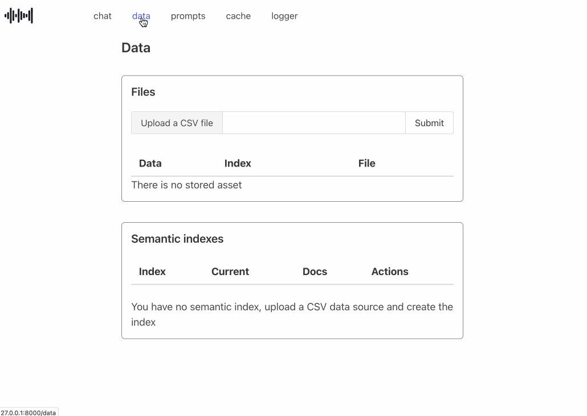

# phpilot

phpilot is yet another PHP GenAI chatbot. Based on [Minipilot](https://github.com/redis/minipilot) (developed in Python with Flask, OpenAI and LangChain), phpilot is a demo written in PHP using:

- The Laravel framework and the Blade templating system
- The LLPhant GenAI framework 
- Some JQuery for UI interactions
- The Bulma CSS framework



From the browser UI you will be able to:

1. Load CSV data, split, embed, store and index in Redis
2. Customize the system and user prompt based on the type of chatbot running (based on the ingested and indexed data)
3. Use semantic caching, with a UI panel to review, edit and remove entries
4. Load and ingest multiple CSV files and create the corresponding indexes. However, only one index at time is used using the Redis aliasing mechanism
5. Application logs are appended to a Redis stream, to review the latest logs directly from the UI


## Configuring phpilot

Make sure you have MySQL and Redis databases running.

For Redis as a vector database, you can use [Redis Stack](https://redis.io/docs/latest/operate/oss_and_stack/install/install-stack/) or [Redis 8.0-M01](https://hub.docker.com/layers/library/redis/8.0-M01/images/sha256-d1244a25c9e33a4995ee850c5a489b7213ca8fa5e94a311429d6873c5011e196?context=explore) as starting from version 8 Redis integrates all the search, vector search, JSON data modeling, time series and probabilistic data structure features. [Read more](https://redis.io/blog/redis-8-0-m01-released-one-redis-for-every-use-case/).

Configure the following variables as environment variables (using `export`) or in a `.env` file stored in the root directory of the project

```
DB_CONNECTION=mysql
DB_HOST=127.0.0.1
DB_PORT=3306
DB_DATABASE=your_database_name
DB_USERNAME=your_username
DB_PASSWORD=your_password

REDIS_CLIENT=predis
REDIS_HOST=127.0.0.1
REDIS_PASSWORD=null
REDIS_PORT=6379

SESSION_DRIVER=redis
CACHE_DRIVER=redis
QUEUE_CONNECTION=redis

OPENAI_API_KEY=your_openai_api_key
```


## Installation

```
git clone https://github.com/mortensi/phpilot.git
cd phpilot
composer install
```


## Execution

Before launching, cache configurations and routes. It's optional, but recommended for production environments.

```
php artisan config:cache
php artisan route:cache
php artisan view:cache
```

Now you can launch the server and the worker process that will listen for jobs on the queue and process them as they arrive. This is used to process new CSV files and create embeddings.

```
php artisan serve
php artisan queue:work
```

Point your browser to [http://127.0.0.1:8000/](http://127.0.0.1:8000/) and start testing!